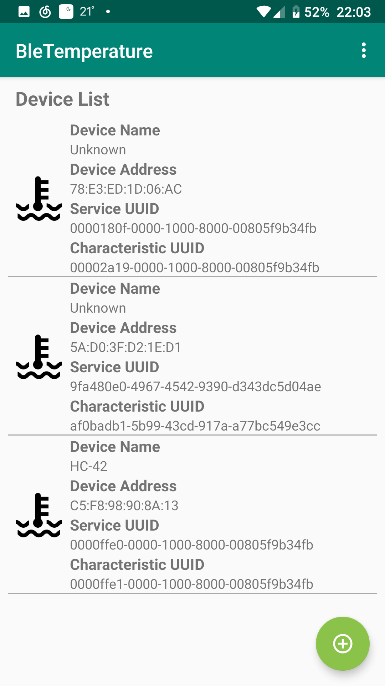

# BleTemperature APP

Monitor Your Bluetooth Low Energy Device and Plot the Data in Your Android App.
----

By coding a Service class called BluetoothLeService and several Activity classes extending from AppCompatActivity, BleTemperature handles all the messy stuff of connecting a BLE device. 

## Feature

* [x] Store BLE device, GattService and characteristic added before.
* [x] Maintain the connection between your android phone and the BLE device.
* [x] Visualize the data received from a selected BLE device and characteristic. (Based on [hellocharts-android](https://github.com/lecho/hellocharts-android))

## How to use

### Click the bottom right button to open the BLE device page


### Choose a BLE device to open the Gatt Service page


### Choose a Service that has a Notify characteristic to open the characteristic page


### Choose a characteristic and return to the first page, the device and characteristic is added now



### Choose the device to open the LineChartView page


## How to hack

To make BleTemperature support your project for data receiving and visualization, just modify ```readData()``` of ```MonitorBleDeviceActivity```.

You can invoke ```getValue()``` to get a byte[] of the data. 
Or ```getStringValue(offset)``` to convert it to a String. 
Or ```getFloatValue(formatType, offset)``` to convert it to a Float value. 
Or ```getIntValue(formatType, offset)``` to convert it to an Integer value.

Supported formatType from ```BluetoothGattCharacteristic```:

- ```FORMAT_SINT8```
- ```FORMAT_SINT16```
- ```FORMAT_SINT32```
- ```FORMAT_UINT8```
- ```FORMAT_UINT16```
- ```FORMAT_UINT32```
- ```FORMAT_FLOAT```
- ```FORMAT_SFLOAT```

## Project Documentation

[Documentation](https://daizhirui.github.io/BleTemperature/)
## Some useful material for learning about BLE

* [GATT Specifications | Bluetooth Technology Website](https://www.bluetooth.com/specifications/gatt/)
* [Chapter 4. GATT (Services and Characteristics)](https://www.oreilly.com/library/view/getting-started-with/9781491900550/ch04.html)

