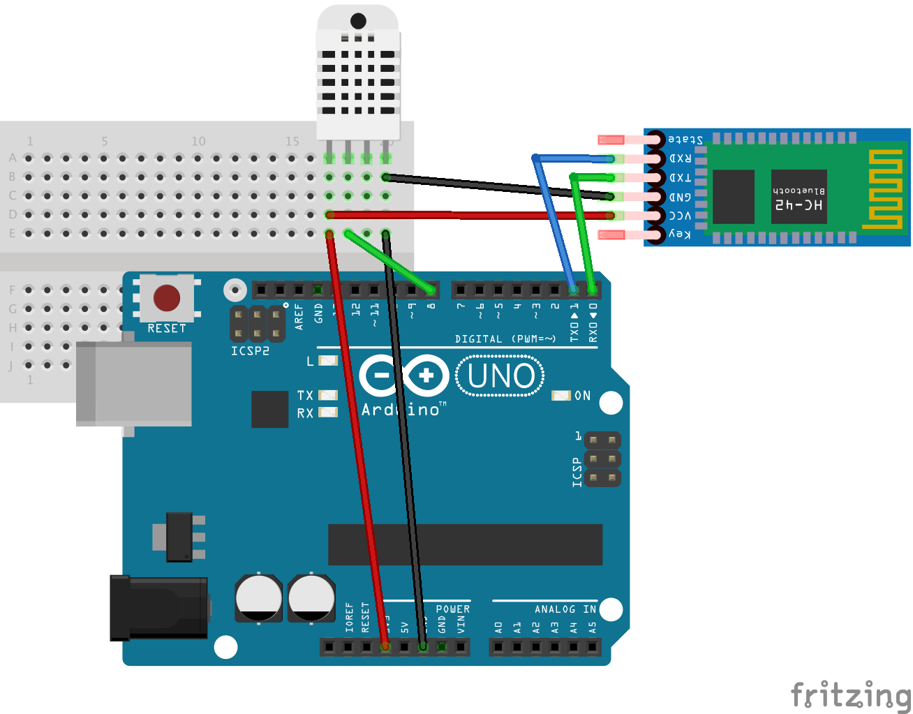

# BLE Temperature Monitor

A simple project to DIY your own bluetooth temperature monitor!

## Parts

* Arduino Uno
* HC-42 or other **Bluetooth Low Energy Module**
* DHT-22 (0.5Hz Sampling) or DHT-11 (1Hz Sampling)

## Setup

### Diagram

### Source

[ArduinoUno.DHT22.ino](ArduinoUno.DHT22.ino)