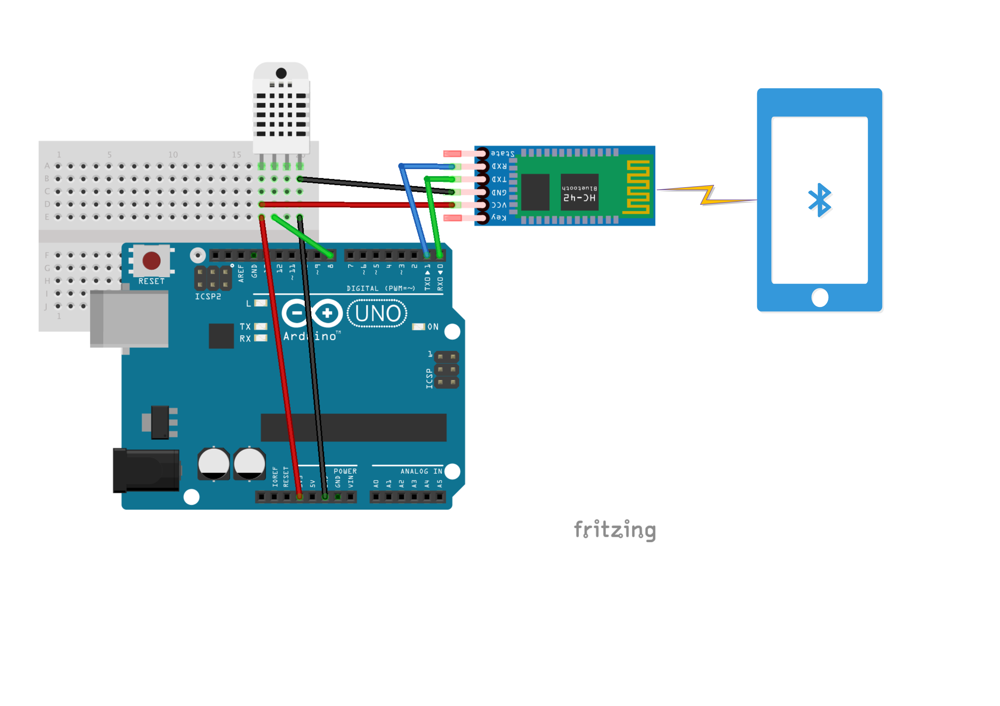

# BleTemperature

In this project, we setup a temperature monitor based on Arduino Uno and Bluetooth Low Energy. Data is transmitted to an Android phone and visualized in an app.
----

## Diagram

## How to setup

* [**Phone End**](./Android_Studio_Project/README.md)
* [**Arduino End**](./ArduinoUno.DHT22/README.md)